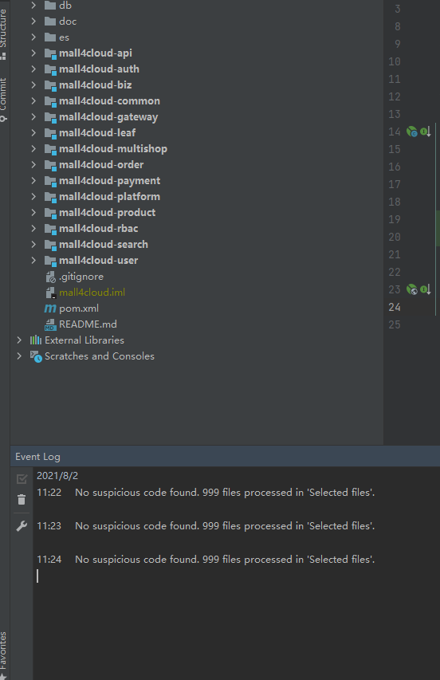
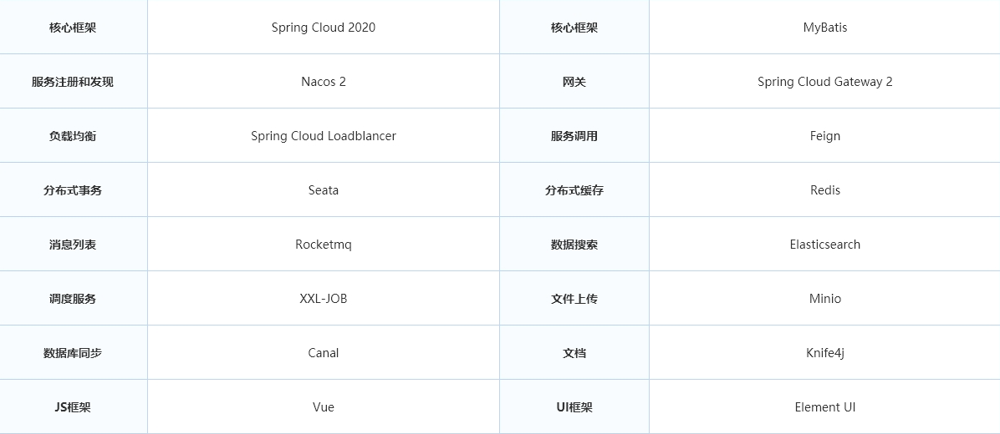
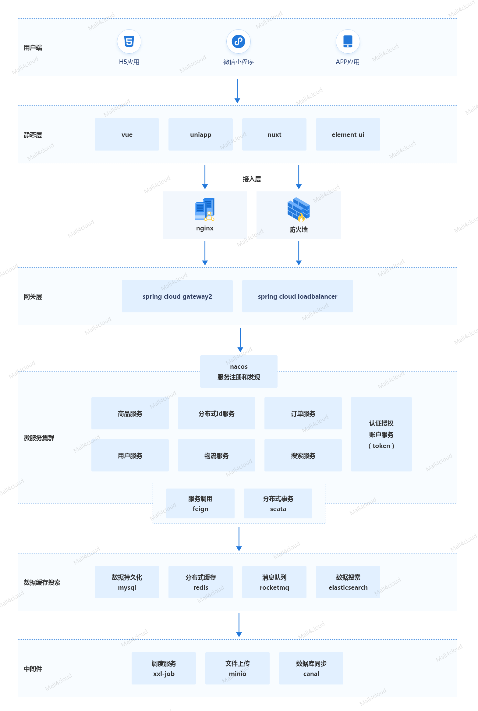
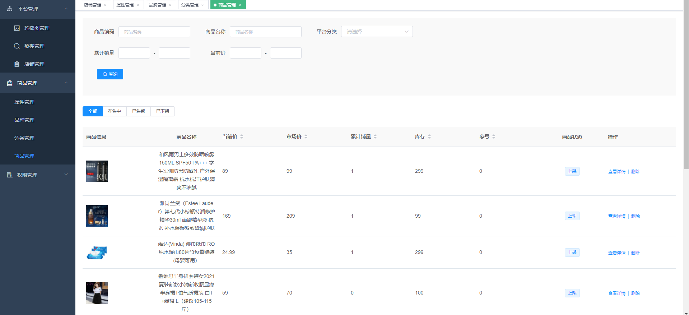
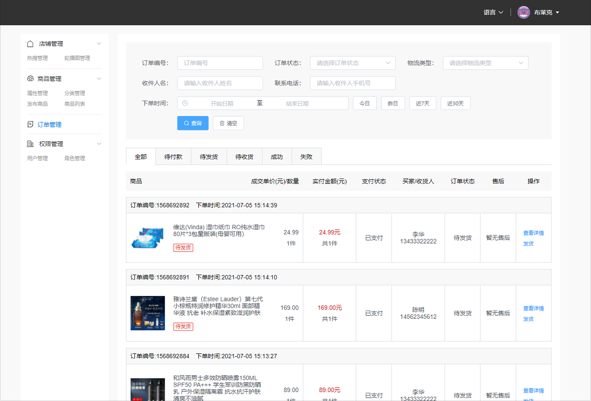
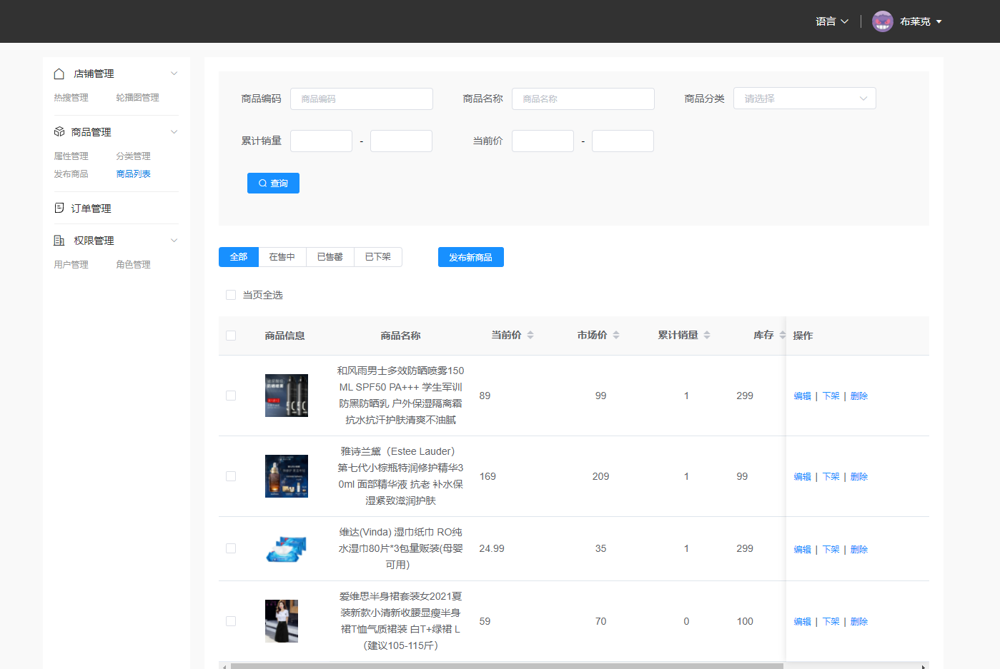
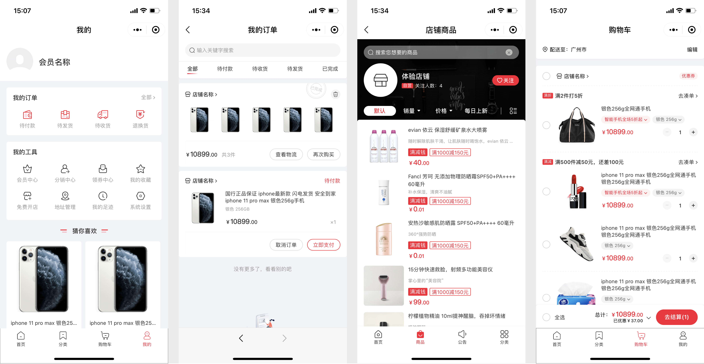

A micro-service B2B2C e-commerce mall system based on Spring Cloud, Nacos, Seata, Mysql, Redis, RocketMQ, canal, ElasticSearch, minio, adopts mainstream Internet technology architecture, new UI design, supports cluster deployment, service registration and discovery, and With a complete order process, etc., the code is completely open source, without any secondary packaging, it is an e-commerce platform system that is very suitable for secondary development.


## Preface

This mall is committed to creating a full-featured, easy-to-maintain micro-service B2B2C e-commerce mall system for medium and large enterprises, which is implemented using mainstream micro-service technologies. The background management system includes platform management, store management, commodity management, order management, specification management, authority management, resource management and other modules.

## Documentation

Is there any documentation for this code? Of course, you have already downloaded it. In the doc folder, I really don't know, so I will give the link:

gitee: https://gitee.com/gz-yami/mall4cloud/tree/master/doc

This project is a project that strictly abides by the Alibaba code specification. The following is the scan result of the code specification




For specific directory structure and code specifications, you can check https://gitee.com/gz-yami/mall4cloud/tree/master/doc/%E4%BB%A3%E7%A0%81%E7%9B%AE%E5% BD%95%E7%BB%93%E6%9E%84

## authorization

In addition to the open source version, this mall also provides a commercial version of the mall. For details, please visit the official website.

Mall official website: https://www.mall4j.com

The mall uses AGPLv3 open source, please abide by the relevant terms of AGPLv3, or contact the author for commercial authorization (https://www.mall4j.com)

## project link

JAVA backend: https://gitee.com/gz-yami/mall4cloud

Platform side: https://gitee.com/gz-yami/mall4cloud-platform

Merchant side: https://gitee.com/gz-yami/mall4cloud-multishop

uni-app: https://gitee.com/gz-yami/mall4cloud-uniapp

## demo address

Commercial version demo address:

PC side: https://cloud-pc.mall4j.com

H5 side: https://h5.mall4j.com/cloud

Mini Program: WeChat search "mall4j microservice version"

## Directory structure specification

We also have our own directory structure


- VO (View Object): Display layer object, usually the object transmitted from the Web to the template rendering engine layer.
- DTO (Data Transfer Object): The data transfer object, the front-end is like the back-end transfer object, similar to param.
- BO (Business Object): business object, internal business object, only transmitted internally, not externally.
- Model: Model layer, this object corresponds to the database table structure one-to-one, and the data source object is transmitted upward through the Mapper layer.
- Controller: It is mainly used for forwarding external access control, checking various basic parameters, or simply processing non-multiplexed services. For simplicity, some transaction-agnostic code is also written here.
- FeignClient: Since there are mutual calls between microservices, here is the interface for internal requests.
- Controller: It is mainly used for forwarding internal access control, checking various basic parameters, or simply processing services that are not multiplexed. For simplicity, some transaction-agnostic code is also written here.
- Service layer: relatively specific business logic service layer.
- Manager layer: general business processing layer, it has the following characteristics:
  - 1) For the layer encapsulated by the third-party platform, preprocess the returned result and convert the exception information, and adapt to the upper-layer interface.
  - 2) The sinking of the general capabilities of the Service layer, such as caching solutions and general processing of middleware.
  - 3) Interact with the DAO layer and reuse the combination of multiple DAOs.
- Mapper persistence layer: data access layer, which interacts with the underlying MySQL.
- Listener: listens to `RocketMQ` for processing, and sometimes listens to `easyexcel` related data.

Regarding `FeignClient`, due to the mutual calls between microservices, `Feign` is an http protocol, which is theoretically for decoupling, but in fact, when the provider interface is modified, but the caller does not modify it, it will cause an exception. So we extract it. There is also the interface exposed internally, which is shared by many places, so we also extracted a module from the interface for easy reference. You can see that under the `mall4cloud-api` module is all the information about the internal `feign` interface.

## Directory Structure

```
mall4cloud
├─mall4cloud-api -- 内网接口
│  ├─mall4cloud-api-auth  -- 授权对内接口
│  ├─mall4cloud-api-biz  -- biz对内接口
│  ├─mall4cloud-api-leaf  -- 美团分布式id生成接口
│  ├─mall4cloud-api-multishop  -- 店铺对内接口
│  ├─mall4cloud-api-order  -- 订单对内接口
│  ├─mall4cloud-api-platform  -- 平台对内接口
│  ├─mall4cloud-api-product  -- 商品对内接口
│  ├─mall4cloud-api-rbac  -- 用户角色权限对内接口
│  ├─mall4cloud-api-search  -- 搜索对内接口
│  └─mall4cloud-api-user  -- 用户对内接口
├─mall4cloud-auth  -- 授权校验模块
├─mall4cloud-biz  -- mall4cloud 业务代码。如图片上传/短信等
├─mall4cloud-common -- 一些公共的方法
│  ├─mall4cloud-common-cache  -- 缓存相关公共代码
│  ├─mall4cloud-common-core  -- 公共模块核心（公共中的公共代码）
│  ├─mall4cloud-common-database  -- 数据库连接相关公共代码
│  ├─mall4cloud-common-order  -- 订单相关公共代码
│  ├─mall4cloud-common-product  -- 商品相关公共代码
│  ├─mall4cloud-common-rocketmq  -- rocketmq相关公共代码
│  └─mall4cloud-common-security  -- 安全相关公共代码
├─mall4cloud-gateway  -- 网关
├─mall4cloud-leaf  -- 基于美团leaf的生成id服务
├─mall4cloud-multishop  -- 商家端
├─mall4cloud-order  -- 订单服务
├─mall4cloud-payment  -- 支付服务
├─mall4cloud-platform  -- 平台端
├─mall4cloud-product  -- 商品服务
├─mall4cloud-rbac  -- 用户角色权限模块
├─mall4cloud-search  -- 搜索模块
└─mall4cloud-user  -- 用户服务
```

## Technical selection



## System Architecture Diagram



## After the mall is deployed, the API address

| 服务                                                 | 地址                  |
| ---------------------------------------------------- | --------------------- |
| mall4cloud-gatway 网关服务                           | http://34.126.131.177:9000 |
| mall4cloud-auth  授权校验服务                        | http://34.126.131.177:9101 |
| mall4cloud-biz     业务代码服务（如图片上传/短信等） | http://34.126.131.177:9104 |
| mall4cloud-leaf   基于美团leaf的生成id服务           | http://34.126.131.177:9100 |
| mall4cloud-multishop 商家服务                        | http://34.126.131.177:9103 |
| mall4cloud-order         订单服务                    | http://34.126.131.177:9106 |
| mall4cloud-payment   支付服务                        | http://34.126.131.177:9113 |
| mall4cloud-product    商品服务                       | http://34.126.131.177:9112 |
| mall4cloud-rbac          用户角色服务                | http://34.126.131.177:9102 |
| mall4cloud-search      搜索服务                      | http://34.126.131.177:9108 |
| mall4cloud-user          用户服务                    | http://34.126.131.177:9105 |


## Deployment tutorial

For deployment tutorials, please refer to the `/Basic development documentation/mall4cloud development environment setup.md` and the middleware installation in the `/development environment setup` directory.

## Code running related screenshots

### 1. Background screenshot

- Platform side

  

- Merchant side

  

  

### 2. Screenshot of the applet



### 3. uni-app screenshot


## Submit feedback
- Mall4j official website https://www.mall4j.com
- WeChat for business cooperation


- mall4cloud open source technology QQ group: 561496886


## springboot version mall please click
https://gitee.com/gz-yami/mall4j

## Your praise and encouragement are the driving force for us to move forward~
## Your praise and encouragement are the driving force for us to move forward~
## Your praise and encouragement are the driving force for us to move forward~
