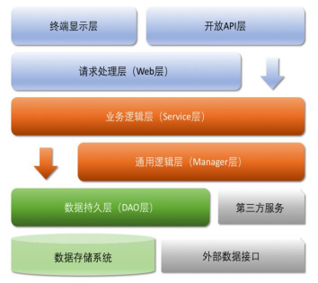
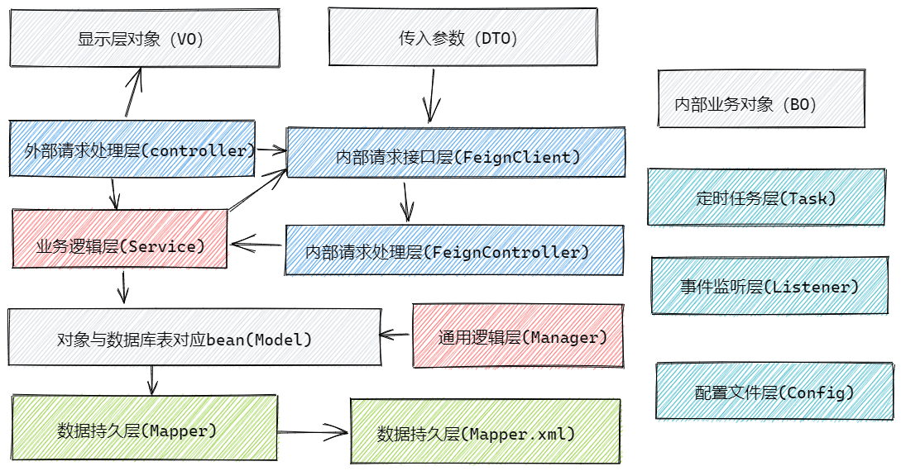

> In order to make it easier for the project to detect the problem of code specification, we use Ali's specification in the project (for details, please refer to the [Java Development Manual (Songshan Edition) in https://github.com/alibaba/p3c). pdf](https://github.com/alibaba/p3c/blob/master/Java Development Manual (Songshan Edition).pdf)), and use the `Alibaba Java Coding Guidelines` plugin for protocol scanning


Let's first look at the directory structure in the specification



- Open API layer: It can directly encapsulate the Service interface and expose it as an RPC interface; encapsulate it into an http interface through the Web; gateway control layer, etc.
- Terminal display layer: The layer where the templates on each side render and execute the display. Currently, it is mainly velocity rendering, JS rendering, JSP rendering, mobile display, etc.
- Web layer: mainly for forwarding access control, checking various basic parameters, or simply processing non-multiplexed services.
- Service layer: relatively specific business logic service layer.
- Manager layer: general business processing layer, it has the following characteristics:
  - 1) For the layer encapsulated by the third-party platform, preprocess the returned result and convert the exception information, and adapt to the upper-layer interface.
  - 2) The sinking of the general capabilities of the Service layer, such as caching solutions and general processing of middleware.
  - 3) Interact with the DAO layer and reuse the combination of multiple DAOs.
- DAO layer: data access layer, which interacts with the underlying MySQL, Oracle, Hbase, OB, etc.
- Third-party services: including RPC service interfaces of other departments, basic platforms, and HTTP interfaces of other companies, such as Taobao open platform, Alipay payment service, AutoNavi map service, etc.
- External data interface: the interface provided by the external (application) data storage service, which is more common in data migration scenarios.


------

The above is the directory structure in the Ali specification, we also have our own directory structure



- VO (View Object): Display layer object, usually the object transmitted from the Web to the template rendering engine layer.
- DTO (Data Transfer Object): The data transfer object, the front-end is like the back-end transfer object, similar to param.
- BO (Business Object): business object, internal business object, only transmitted internally, not externally.
- Model: Model layer, this object corresponds to the database table structure one-to-one, and the data source object is transmitted upward through the Mapper layer.
- Controller: It is mainly used for forwarding external access control, checking various basic parameters, or simply processing non-multiplexed services. For simplicity, some transaction-agnostic code is also written here.
- FeignClient: Since there are mutual calls between microservices, here is the interface for internal requests.
- Controller: It is mainly used for forwarding internal access control, checking various basic parameters, or simply processing services that are not multiplexed. For simplicity, some transaction-agnostic code is also written here.
- Service layer: relatively specific business logic service layer.
- Manager layer: general business processing layer, it has the following characteristics:
  - 1) For the layer encapsulated by the third-party platform, preprocess the returned result and convert the exception information, and adapt to the upper-layer interface.
  - 2) The sinking of the general capabilities of the Service layer, such as caching solutions and general processing of middleware.
  - 3) Interact with the DAO layer and reuse the combination of multiple DAOs.
- Mapper persistence layer: data access layer, which interacts with the underlying MySQL.
- Task layer: Since there will be timed tasks between each service, such as timed confirmation of receipt, timed invalidation of activities, etc., the Task here is actually connected to `xxl-job` (for details, see https:// github.com/xuxueli/xxl-job ) for task scheduling.
- Listener: listens to `RocketMQ` for processing, and sometimes listens to `easyexcel` related data.


Regarding `FeignClient`, due to the mutual calls between microservices, `Feign` is an http protocol, which is theoretically for decoupling, but in fact, when the provider interface is modified, but the caller does not modify it, it will cause an exception. So we extract it. There is also the interface exposed internally, which is shared by many places, so we also extracted a module from the interface for easy reference. You can see that under the `mall4cloud-api` module is all the information about the internal `feign` interface.


## Directory Structure

```
mall4cloud
├─mall4cloud-api -- 内网接口
│  ├─mall4cloud-api-auth  -- 授权对内接口
│  ├─mall4cloud-api-biz  -- biz对内接口
│  ├─mall4cloud-api-leaf  -- 美团分布式id生成接口
│  ├─mall4cloud-api-multishop  -- 店铺对内接口
│  ├─mall4cloud-api-order  -- 订单对内接口
│  ├─mall4cloud-api-platform  -- 平台对内接口
│  ├─mall4cloud-api-product  -- 商品对内接口
│  ├─mall4cloud-api-rbac  -- 用户角色权限对内接口
│  ├─mall4cloud-api-search  -- 搜索对内接口
│  └─mall4cloud-api-user  -- 用户对内接口
├─mall4cloud-auth  -- 授权校验模块
├─mall4cloud-biz  -- mall4cloud 业务代码。如图片上传/短信等
├─mall4cloud-common -- 一些公共的方法
│  ├─mall4cloud-common-cache  -- 缓存相关公共代码
│  ├─mall4cloud-common-core  -- 公共模块核心（公共中的公共代码）
│  ├─mall4cloud-common-database  -- 数据库连接相关公共代码
│  ├─mall4cloud-common-order  -- 订单相关公共代码
│  ├─mall4cloud-common-product  -- 商品相关公共代码
│  ├─mall4cloud-common-rocketmq  -- rocketmq相关公共代码
│  └─mall4cloud-common-security  -- 安全相关公共代码
├─mall4cloud-gateway  -- 网关
├─mall4cloud-leaf  -- 基于美团leaf的生成id服务
├─mall4cloud-multishop  -- 商家端
├─mall4cloud-order  -- 订单服务
├─mall4cloud-payment  -- 支付服务
├─mall4cloud-platform  -- 平台端
├─mall4cloud-product  -- 商品服务
├─mall4cloud-rbac  -- 用户角色权限模块
├─mall4cloud-search  -- 搜索模块
└─mall4cloud-user  -- 用户服务
```
