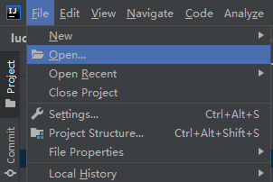
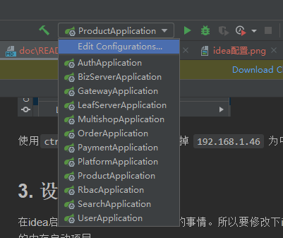
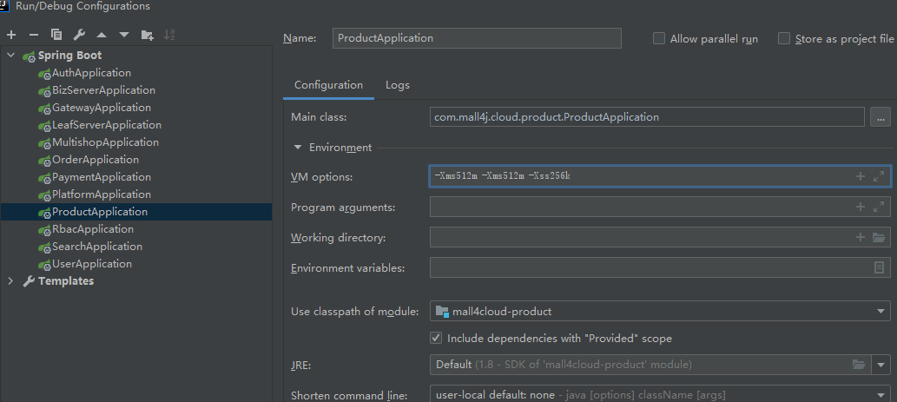
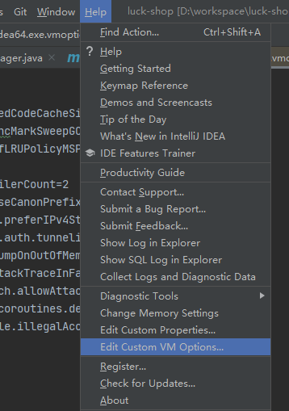
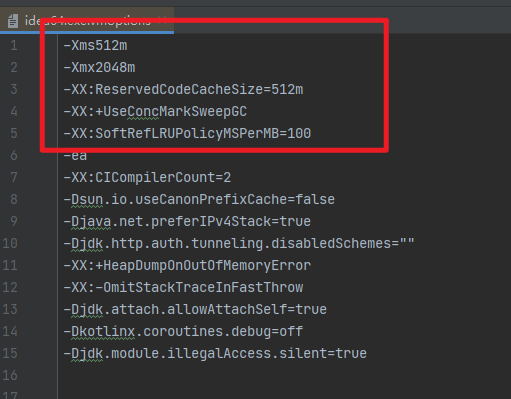
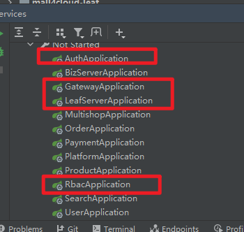

## 1. Middleware installation

This project is a distributed project and relies on a lot of middleware, so it is necessary to build the middleware before starting the background project.

Middleware installation reference `./docker-compose/README.md` this article

## 2. Import the project

### 2.1 Install jdk + maven + git

Download the project using git


Use idea, click open to open the downloaded directory




Use `ctrl + shift + r` to globally replace `34.126.131.177` as the middleware server ip

## 3. Set the idea memory

Starting all the projects in the idea is very difficult. So you need to modify the configuration of the idea so that it can have enough memory to start the project

### 3.1 Reduce the memory occupied by jar startup

Edit the virtual machine configuration, change the memory of each service to 512M, `-Xms512m -Xms512m -Xss256k`, if the machine is really not enough memory, you can reduce 512 appropriately, but reduce it to a certain extent, such as 256m will cause the java virtual machine to frequently The garbage collection will be more difficult, so 512m is recommended.





### 3.2 Increase the memory available for idea

Edit the idea configuration, increase the memory, at least 2G, according to the needs, you can appropriately increase to improve the fluency.

```vmoptions
-Xms512m
-Xmx2048m
-XX:ReservedCodeCacheSize=512m
-XX:+UseConcMarkSweepGC
-XX:SoftRefLRUPolicyMSPerMB=100
```





After the configuration is complete, restart the idea, and all projects can be started at this time.

## 4. Start the project



The items in the box are the items that must be started, the others are started on demand, it is recommended to start all of them, and a computer with more than 16G memory is required

