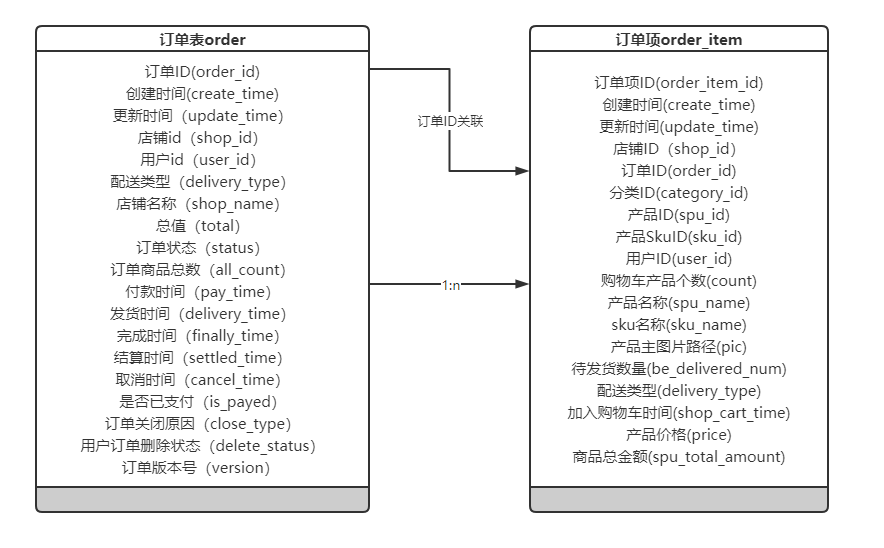
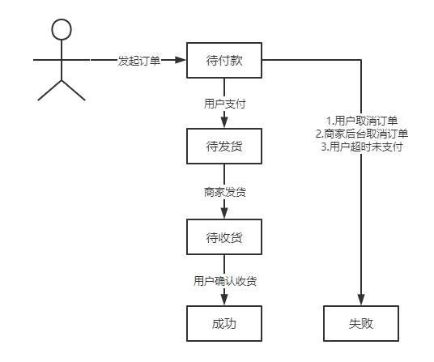

## Order table structure

### 1 Database structure



Each item in an order table (order) corresponds to multiple `order_item`, which are related by `order_id`

- An order records the status, time, total amount, etc. of each order

- An order has multiple order_item, and each order item records the information of each item

#### 1.1 Order-Order

Each time an order is placed, an order record is generated, which contains multiple items or one item.

```java
	/**
     * 订单ID
     */
    private Long orderId;

    /**
     * 用户ID
     */
    private Long userId;

	/**
     * 店铺id
     */
    private Long shopId;

	/**
	 * 店铺名称
	 */
	private String shopName;

    /**
     * 订单状态 1:待付款 2:待发货 3:待收货(已发货) 5:成功 6:失败
     */
    private Integer status;

    /**
     * 订单关闭原因 1-超时未支付 4-买家取消
     */
    private Integer closeType;

	/**
     * 总值
     */
    private Long total;

    /**
     * 配送类型 :无需快递
     */
    private Integer deliveryType;

    /**
     * 订单商品总数
     */
    private Integer allCount;

    /**
     * 付款时间
     */
    private Date payTime;

    /**
     * 发货时间
     */
    private Date deliveryTime;

    /**
     * 完成时间
     */
    private Date finallyTime;

    /**
     * 取消时间
     */
    private Date cancelTime;

    /**
     * 是否已支付，1.已支付0.未支付
     */
    private Integer isPayed;

    /**
     * 用户订单删除状态，0：没有删除， 1：回收站， 2：永久删除
     */
    private Integer deleteStatus;
```

Each order is associated with a user (`user_id`), a shop (`shop_id`)

- `status` order status has six types: 1: Pending payment 2: Pending delivery 3: Pending receipt (delivered) 5: Success 6: Failure

**The state transitions are as follows:**



- `closeType` order is closed for two reasons: 1: Overtime unpaid 2: Buyer canceled

- `total` total value, refers to the total amount of all items in an order, that is, the sum of `spuTotalAmount` in the line item associated with this order
- `deliveryType` delivery type, currently only the type without express
- `allCount` the total number of items in the order, that is, the total number of items included in an order

#### 1.2 order_item - line item

Each order is associated with the line item table according to order_id, an order can have multiple line items

```java
	/**
     * 订单项ID
     */
    private Long orderItemId;

    /**
     * 店铺id
     */
    private Long shopId;

    /**
     * 订单id
     */
    private Long orderId;

    /**
     * 产品ID
     */
    private Long spuId;

    /**
     * 产品SkuID
     */
    private Long skuId;

    /**
     * 用户Id
     */
    private Long userId;

    /**
     * 购物车产品个数
     */
    private Integer count;

    /**
     * 产品名称
     */
    private String spuName;

    /**
     * sku名称
     */
    private String skuName;

    /**
     * 产品主图片路径
     */
    private String pic;

    /**
     * 单个orderItem的配送类型 无需快递
     */
    private Integer deliveryType;

    /**
     * 加入购物车时间
     */
    private Date shopCartTime;

    /**
     * 产品价格
     */
    private Long price;

    /**
     * 商品总金额
     */
    private Long spuTotalAmount;
```

- `count` cart items: the number of items added to the cart
- `spuTotalAmount` total product amount: the product of the product price `price` and the number of products in the shopping cart `count`

### 2 Interface

