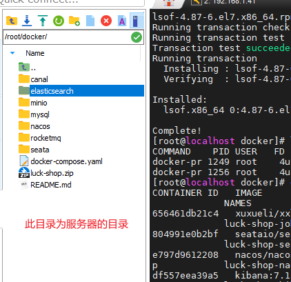
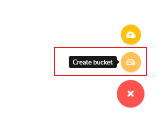
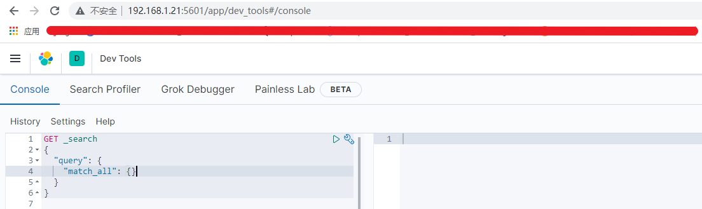
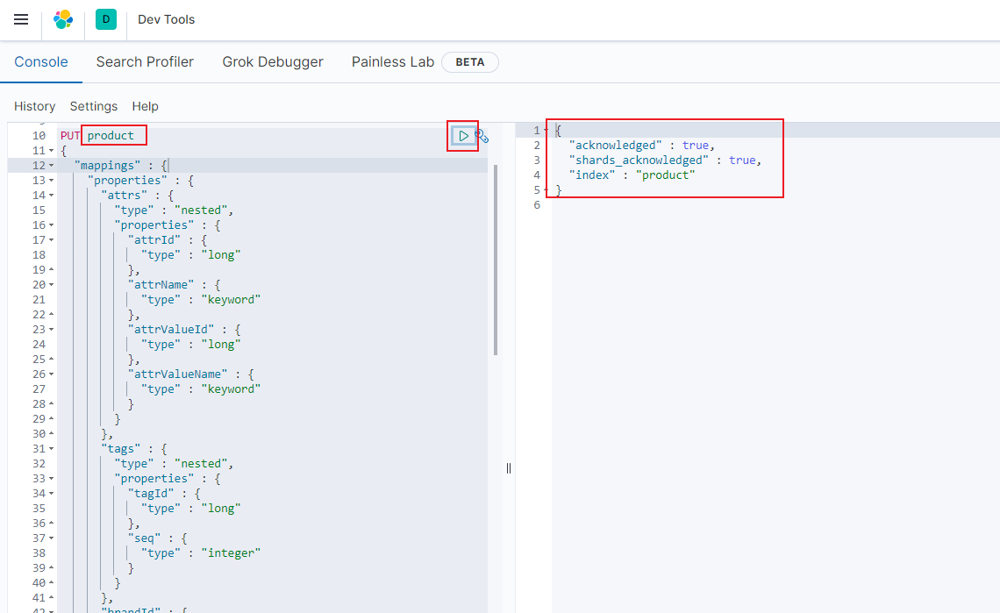

> If you don't know how to install docker-compose, you can read the "centos installation docker" document

1. On the file editor, use the global replacement method to replace all `34.126.131.177` under the folder with the ip of the server

2. Pack and upload all files and folders in this directory to the server, the effect is as shown in the figure



3. Execute the authorization command

```
chmod -R 777 ./rocketmq/broker/logs
chmod -R 777 ./rocketmq/broker/store
chmod -R 666 ./minio/data
chmod -R 777 ./elasticsearch/data
```

4. Start the container

> ps: The container needs to download a total of about 7G of data, please wait patiently

```
docker-compose up -d --build
```


5. Each end access path and its password

Please replace 34.126.131.177 with the server ip by yourself

  - mysql: use the database connection tool to connect, port 3306 account and password root/root
  - minio: http://34.126.131.177:9000 account and password admin/admin123456
  - redis: port 6379, no password
  - nacos: http://34.126.131.177:8848/nacos account and password nacos/nacos
  - kibana: http://34.126.131.177:5601
  - rocketmq-console: http://34.126.131.177:8180


6. Visit the minio management page, there is a plus sign in the lower right corner, create a storage area (create bucket) named `mall4cloud`


Change policy bucket 'mall4cloud' to download mode by exec command

```
wget https://dl.min.io/client/mc/release/linux-amd64/mc
chmod +x mc
./mc config host add minio-server http://127.0.0.1:9000 admin admin123456
./mc mb minio-server/mall4cloud
./mc policy set download minio-server/mall4cloud
```

7. Create es index

new index

Open the console according to your local ip address, the following interface

http://34.126.131.177:5601/app/dev_tools#/console



Need to create `order`, `product` two indexes

Copy the following command to the left frame, click to execute

The contents of the command refer to `../es/order.md` `../es/product.md` in this directory




